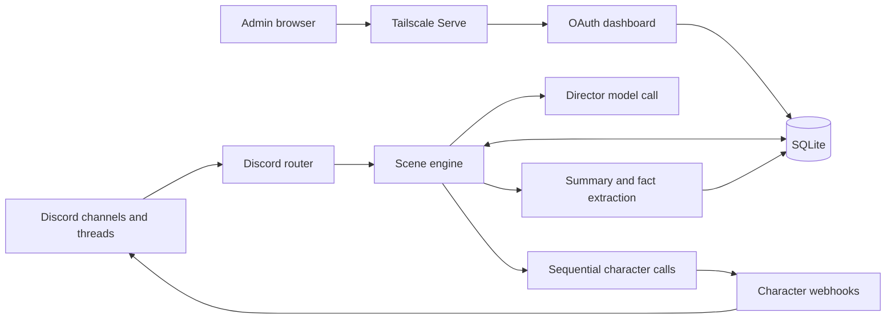

# Architecture

llmcord keeps prompt state in SQLite and assembles a fresh prompt for each character response. Bot and dashboard are separate processes that share the database. The model provider does not hold the canonical conversation state.

## Modules

| File | Responsibility |
| --- | --- |
| [`llmcord.py`](../llmcord.py) | Bot entry point. |
| [`web_main.py`](../web_main.py) | Web entry point. |
| [`migrate.py`](../migrate.py) | Migration entry point used by Compose. |
| [`llmcord_core/config.py`](../llmcord_core/config.py) | YAML settings and environment-backed secrets. |
| [`llmcord_core/discord_bot.py`](../llmcord_core/discord_bot.py) | Discord events, slash commands, webhooks, and message delivery. |
| [`llmcord_core/engine.py`](../llmcord_core/engine.py) | Director, prompt assembly, branches, and memory extraction. |
| [`llmcord_core/models.py`](../llmcord_core/models.py) | OpenAI, Anthropic, and OpenAI-compatible adapters. |
| [`llmcord_core/store.py`](../llmcord_core/store.py) | SQLite schema, migrations, and scoped data access. |
| [`llmcord_core/lore.py`](../llmcord_core/lore.py) | Lore scope calculation and token estimates. |
| [`llmcord_core/world_info.py`](../llmcord_core/world_info.py) | Runtime World Info evaluation. |
| [`llmcord_core/lorebooks.py`](../llmcord_core/lorebooks.py) | Standalone lorebook parsing and rule normalization. |
| [`llmcord_core/cards.py`](../llmcord_core/cards.py) | V2/V3 JSON and PNG character-card parsing. |
| [`llmcord_core/web.py`](../llmcord_core/web.py) | Discord OAuth, administrator checks, CSRF, and dashboard actions. |
| [`llmcord_core/templates/`](../llmcord_core/templates/) | Server-rendered dashboard pages. |
| [`llmcord_core/dashboard.py`](../llmcord_core/dashboard.py) | NiceGUI pages, reusable editors, authenticated live events, and uploads. |
| [`llmcord_core/auth.py`](../llmcord_core/auth.py) | Discord authorization shared by HTTP and live callbacks. |
| [`llmcord_core/admin.py`](../llmcord_core/admin.py) | Shared admin orchestration and sample-only prompt previews. |
| [`llmcord_core/admin_store.py`](../llmcord_core/admin_store.py) | Versioned presets, lore identities/import provenance, ownership transfers, and avatar metadata. |
| [`llmcord_core/prompts.py`](../llmcord_core/prompts.py) | Preset import/export, bounded macros, ordered messages, adaptations, and trimming. |
| [`llmcord_core/avatars.py`](../llmcord_core/avatars.py) | Image validation, Discord publication, and bounded emotion-header parsing. |
| [`llmcord_core/usage.py`](../llmcord_core/usage.py) | Provider-reported token usage, per-task attribution, and cost estimates. |
| [`llmcord_core/identity.py`](../llmcord_core/identity.py) | Discord speaker identities as message metadata, separate from character personas. |
| [`llmcord_core/errors.py`](../llmcord_core/errors.py) | Actionable error text without credentials or full provider bodies. |
| [`llmcord_core/scene_ui.py`](../llmcord_core/scene_ui.py) | Dashboard guideline editors, owner deletion dialogs, and direct lore imports. |
| [`llmcord_core/lore_workspace.py`](../llmcord_core/lore_workspace.py) | Dashboard lore lists, search, pagination, and selection actions. |
| [`llmcord_core/lore_drag.py`](../llmcord_core/lore_drag.py), [`lore_drag.js`](../llmcord_core/lore_drag.js) | Drag-and-drop lore transfers using stable entry snapshots. |

For engineering detail (process and sequence diagrams, shared state, known defects by ID, and the rework plan) see [`engineering/`](engineering/):

| Document | Contents |
| --- | --- |
| [System map](engineering/system-map.md) | Processes, component diagram, turn and dashboard-auth sequences, shared state, external dependencies |
| [Audit](engineering/audit.md) | Findings (`BUG-*`, `PERF-*`, `SEC-*`, `REL-*`, `ARCH-*`, `UX-*`, `TOOL-*`) with evidence and confidence |
| [Roadmap](engineering/roadmap.md) | Rework phases R1–R6 and open product decisions |

## Scene flow

1. Discord routing accepts an explicit invitation or considers an ambient turn in a bound channel. Threads resolve their space through the parent channel.
2. The engine filters the cast to eligible characters. A structured director result chooses up to the configured three speakers. Ambient turns may select none.
3. The human message is stored as a node. Each speaker gets its own card, permitted lore, opted-in personal facts, encounters, branch summary, and visible message history. A hub guest's prompt does not include another guest's private world lore.
4. The dialogue adapter streams one line. A character webhook posts it; the bot saves its Discord message ID, parent ID, source trace, and World Info activations. The next speaker can react to earlier lines from the same turn.
5. The memory adapter extracts facts and a branch summary. Repeated shared facts become local durable lore after evidence from separate scene roots. Personal facts are written only with consent.

SQLite runs in WAL mode with a busy timeout. Schema version is held in `PRAGMA user_version`; migration backs up an existing older database before upgrading. Compose orders the migration service before bot and web startup.

The current schema is v3. Administration writes use transactions with revision checks. Lore activation identities survive moves between the existing lore tables; an import ledger tracks baselines and moved/deleted dispositions. Guild preset activation points to an immutable revision. Each scene captures that revision before its first model call. Provider gateways consume the renderer's ordered messages, with explicit adaptations for Anthropic's top-level system field.

NiceGUI runs inside FastAPI under `/admin/` with one web worker. Existing form routes remain available for compatibility/testing and reuse the same authorization/storage services. Character avatars remain in SQLite; published Discord CDN assets provide per-message avatar overrides without exposing the private dashboard. An emotion header is resolved before the webhook placeholder is posted and is excluded from stored dialogue.

## Rewinds and retention

Conversation nodes store `parent_id` and `root_id`. A reply to an earlier saved character line walks that line's ancestors. Later sibling nodes are excluded. Source message IDs on local facts and memories are checked against the selected branch where relevant. World Info timing reads saved activations from branch nodes, so a rewind follows its own activation history. `/context` reads the response trace attached to a saved webhook message.

The daily cleanup removes old conversation nodes, summaries tied to them, response traces, and World Info activation rows. It does not remove durable lore or opted-in personal facts. See [Lore, imports, and memory](lore-and-memory.md) for the user-facing controls.

## Current scope

The code targets casual text skits with bounded image attachments. Voice chat, TRPG mechanics, external tools, and semantic lore search are future work. SillyTavern-only prompt surfaces are preserved on import and shown as inactive rather than silently mapped to a different location.
