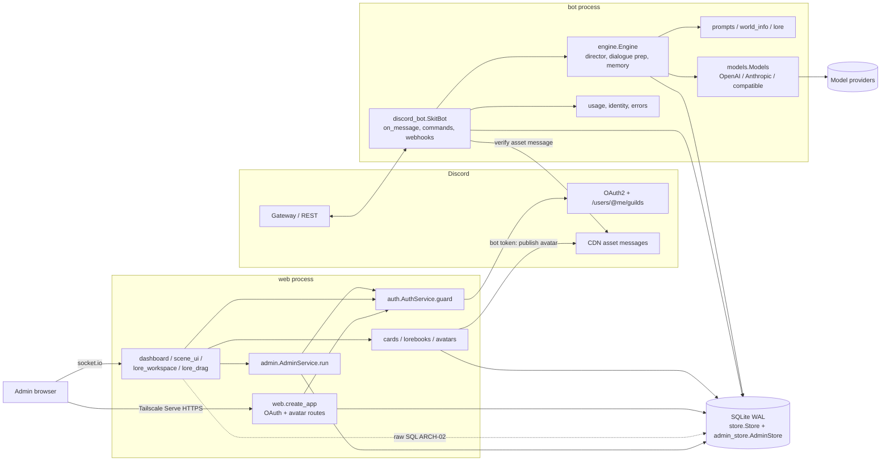
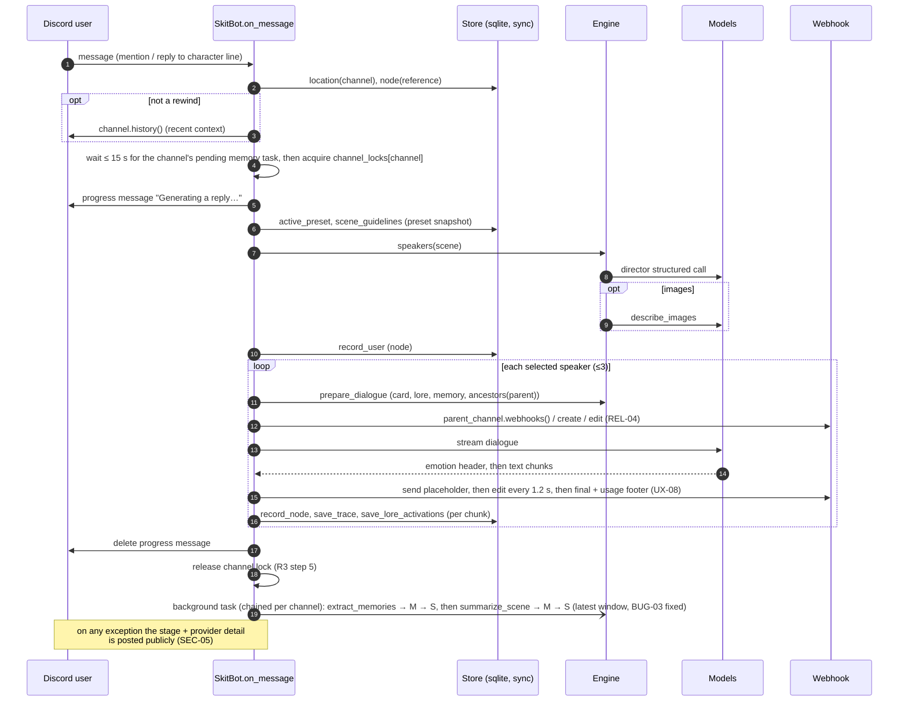

# System map

Snapshot at commit `1270c09`. This is engineer-facing; the user-facing overview is `docs/architecture.md`. Finding IDs refer to the [hardening audit](history/audit-2026-10-07.md); current work items to [the backlog](backlog.md).

## Processes

| Process | Entry point | Runs | Owns in memory | Talks to |
| --- | --- | --- | --- | --- |
| **bot** | `llmcord.py` → `discord_bot.SkitBot` | discord.py gateway client. Events (`on_message`), slash commands (`register_commands`), webhook delivery, daily `_cleanup_loop` | `channel_locks`, `webhook_locks`, `webhook_defaults`, `checked_avatar_assets` (REL-04); one `Store`; `Models` clients | Discord gateway + REST (bot token), model providers, SQLite |
| **web** | `web_main.py` → `web.create_app` (uvicorn, one worker) | FastAPI: OAuth, avatar GETs, redirects to `/admin`, NiceGUI mounted at `/admin` (`dashboard.mount_dashboard`) | `app.state.sessions`; `AuthService.request_locks`, `retry_at`, `refresh_locks` (SEC-04); one `Store`; NiceGUI `Client` instances | Discord OAuth + REST (user bearer tokens; bot token for channels/avatar publish), SQLite |
| **migrate** | `migrate.py` → `Store(path).close()` | One-shot before the others (Compose ordering). Backs up, then upgrades `PRAGMA user_version` (currently 6) | — | SQLite (path from `config.resolve_database_path`: env, then YAML, then default; shared with bot and web since R1) |

The processes do not use IPC. They share one SQLite file in WAL mode with `busy_timeout=5000` (`store.py:140`). The bot reads the database fresh on each turn, so dashboard edits apply on the next turn. All sqlite calls are synchronous on each process's event loop (REL-01).

## Components



## Turn sequence (one explicit mention or reply)



Ambient turns follow the same path. They first take the channel lock briefly to count messages and check the cooldown, and the director may choose no speaker.

## Dashboard auth sequence (where Discord calls happen)

Every `guard` box is one `GET /users/@me/guilds` with the user's bearer token. None of them are cached, and they are serialized per token (PERF-01).

```mermaid
sequenceDiagram
  autonumber
  participant Br as Browser
  participant MW as web middleware (CSP rewrite, no-store)
  participant P as NiceGUI page /admin/guild/{id}
  participant A as AuthService
  participant D as Discord API
  participant IO as socket.io handlers (dashboard.py)
  participant Svc as AdminService.run
  Br->>MW: GET /admin/guild/1 (cookie)
  MW->>P: route
  P->>A: require_admin → guard
  A->>A: session(ident) (refresh token if near expiry → POST /oauth2/token)
  A->>D: GET /users/@me/guilds  [check 1]
  P->>D: GET /guilds/1/channels (bot token, setup panel)
  P-->>MW: HTML for all 5 tabs (eager)
  MW-->>Br: buffered, nonce-injected, uncompressed (PERF-04)
  Br->>IO: connect (implicit_handshake) → socket_allowed → guard  [check 2]
  Br->>IO: handshake → socket_allowed → guard  [check 3]
  Br->>IO: first event → guard  [check 4]
  loop every UI event (keystroke, click, tab change)
    Br->>IO: event
    IO->>A: guard  [check]
    alt guard fails / rate limited
      IO--xBr: event dropped; bound client gets a negative notice
    else ok
      IO->>Svc: handler → ctx.run(op)
      Svc->>A: guard (csrf/origin pass by construction, SEC-03)  [check]
      Svc->>Svc: op() → Store; audit
      opt mutation
        Svc-->>Br: ui.navigate.reload() → whole page again
      end
    end
  end
  Br->>MW: GET /admin/.../avatars/{slot} (each image)
  MW->>A: require_admin → guard  [check per image]
```

Uploads (`/admin/_nicegui/client/*/upload/*`) run `guard` with the `X-CSRF-Token` header and the Origin header before reading the body. The only other state-changing HTTP POST is `/logout` (form csrf + Origin); socket.io long-polling POSTs carry live events, which the patched socket handlers and `AdminService.run` guard. The legacy Jinja POST routes were removed in R6 (SEC-02).

## Shared state

| State | Where | Shared by | Notes |
| --- | --- | --- | --- |
| Spaces, channel bindings, casts, ambient | SQLite `spaces`, `hub_worlds`, `channels`, `thread_casts` | bot ⇄ web | Rebinding resets the cast (UX-03) |
| Characters, avatars, avatar slots and assets | `characters`, `avatar_slots`, `avatar_assets` | bot ⇄ web | Blobs in SQLite (PERF-03) |
| Lore and lorebooks | `lore`, `guild_lore_entries`, `lorebooks`, `lorebook_entries`, `lorebook_space_links`, `card_imports`/`import_entries` | bot ⇄ web | Stable `entry_key` identities across moves |
| Scene tree | `nodes` (`parent_id`, `root_id`), `summaries`, `trace`, `lore_activations` | bot (writes), web (reads) | `INSERT OR REPLACE` cascade (BUG-04) |
| Memory | `consent`, `personal_memories`, `candidates`, `evidence`, `encounters` | bot | Personal facts only after opt-in |
| Presets | `prompt_presets`, `prompt_revisions`, `guild_settings.preset_id`, `scene_guidelines` | web writes, bot snapshots | Scene captures one revision per turn |
| Usage, ambient, resets, webhooks | `model_usage`, `ambient_activity`, `scene_resets`, `webhooks` | bot | Expired with history |
| Spending caps (FEAT-16) | `bot_settings` (one row), `spend_days`, `budget_notices` | web writes settings; bot writes spend and claims notices | Bot-wide, not per server. `spend_days` is filled in the same transaction as `model_usage`, kept 400 days, never expired with history. `SkitBot.run_scene` checks the hard cap before each turn; `budget_notices` claims make each operator DM once per period across both processes |
| Audit, revisions | `admin_audit` (metadata only), `owner_revisions` | web | Written by `AdminService.run`; operator actions by `AdminService.run_operator` under guild 0, which a future viewer must not treat as a wildcard |
| Sessions, auth locks | web process memory | web only | Lost on restart; unbounded (SEC-04) |
| Turn locks, webhook cache | bot process memory | bot only | Unbounded (REL-04) |

## External dependencies

| Dependency | Used by | Purpose | Failure behavior |
| --- | --- | --- | --- |
| Discord gateway and REST (`discord.py==2.6.4`) | bot | Events, commands, webhooks, history | discord.py reconnects; a webhook failure fails the turn, and the error is posted publicly (SEC-05) |
| Discord OAuth2 and `/users/@me/guilds` (`httpx`) | web | Login, token refresh, every authorization check | 401 drops the session; 429 or `Remaining: 0` makes the next check sleep; network error → 503; a rejected socket event is dropped and the bound client is notified (PERF-01, R2 step 5) |
| Discord REST with the bot token (`httpx`) | web | Guild channel list; avatar publication to the asset channel | Publish raises `ValueError` and shows a notify |
| Model providers: `openai==2.6.1`, `anthropic==0.69.0`, OpenAI-compatible | bot (web only builds previews) | Director, dialogue stream, image description, memory, summary | Per-profile `timeout_seconds` (120) and `max_retries` (1) since R3 |
| `mini-racer==0.14.1` (V8) | bot | JS-compatible regex lore keys | Exceptions → no match; new isolate per match (REL-03) |
| `nicegui==3.17.1`, `fastapi==0.142.2`, `uvicorn`, `Jinja2`, `python-multipart` | web | Dashboard, uploads (Jinja2 stays pinned because NiceGUI requires it; app code no longer imports it) | `dashboard.py` monkey-patches socket handlers |
| `Pillow` | web | Avatar normalization | Invalid image → `ValueError` |
| SQLite (stdlib) | all | Single source of truth | `busy_timeout` 5 s, blocks the event loop (REL-01); slow calls ≥ 50 ms logged since R3 |
| Tailscale Serve | deployment | HTTPS + private reachability for `/admin` | Outside the app |
